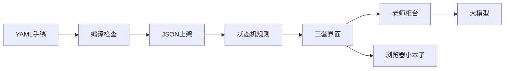
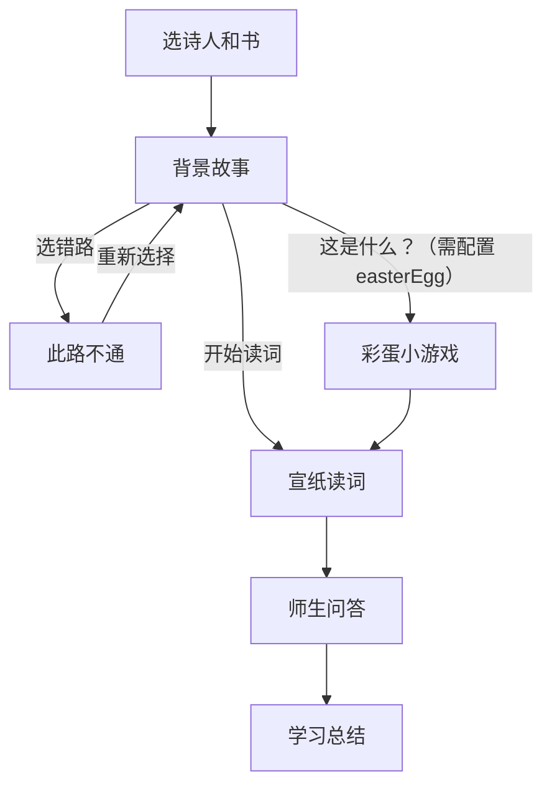

# 项目架构

## 这篇文档讲什么 / 适合谁看

- **小朋友**：想知道这个游戏网站是怎么搭起来的，像搭积木一样一层一层看。
- **进阶**：想知道各层用了哪些工具、代码放在哪里。

---

## 小朋友版：把它想成一家小书店

这个项目像一家专门卖「诗词小游戏」的书店：

| 书店里的东西 | 在项目里叫什么 | 它做什么 |
| --- | --- | --- |
| 作者写的手稿（YAML） | DLC 内容层 | 故事、诗词、题目都写在这里 |
| 店员把书整理上架 | 编译层 | 检查手稿有没有写错，再变成游戏能读的 JSON |
| 店里的游乐规则 | 运行层（状态机 + 界面） | 决定现在是翻书、读词，还是问答 |
| 柜台后的老师 | 服务器 AI 层 | 真正的老师提示词藏在柜台后面，小朋友改不了 |
| 小本子记你玩过什么 | 存储层 | 游戏文件在电脑里，你的选择记在浏览器里 |



玩一局的顺序也很像上课：



开场那一页（月亮、白卡片、「走进梦里」）用浏览器自己会播的动画。页面一打开，卡片就会淡出来，你看得见。点按钮、翻页、选答案，要等游戏程序把按钮接上电；开发预览时，门口还有一个小助手，专门帮预览窗口把线路接好。

---

## 进阶版：现在用的工具

### 网站骨架：Next.js + React + TypeScript

页面在 `app/` 里，接口也在 `app/api/` 里，同一个项目就能上课、也能问老师。TypeScript 会在编译时检查 DLC 字段，少写一个字段会直接报错，游戏打不开那种问题会更早被发现。

### 回合规则：XState

本课是「故事 → 读词 → 问答」这种翻页、分支、阶段切换。状态机把「现在轮到谁、下一步去哪」写成明确规则。DLC 只提供数据，学生不用写游戏引擎代码。

状态机的主要状态见 [`src/game/gameMachine.ts`](../src/game/gameMachine.ts)：

- `story`：旁白 / 史实 / 选择 / Game Over
- `pageTransition`：翻页动画进行中
- `easterEgg`：可选彩蛋小游戏（仅当 manifest 配置了 `easterEgg`）
- `poem`：逐句揭示
- `quiz.idle | submitting | success | error`（选择题答错后 `RETRY` 回到同一题的 `idle`；有 HINT 的题，课堂 UI 应停在作答拍，不重播老师提问和何解，见 `src/game/quizBeat.ts`）
- `summary.generating | ready | error

### 其他库

- **Zod**：运行时检查 DLC 和 AI 返回的 JSON，防止坏数据进游戏。
- **yaml**：给内容作者用更像作文的格式写 DLC，再编译成 JSON。
- **CSS 动画**：开场页 [`NarrativeGate`](../src/components/NarrativeGate.tsx) 的月亮、云、卡片。样式在 [`narrativeGate.module.css`](../src/components/narrativeGate.module.css)，浏览器读到就会播放。
- **motion**：读词页、问答页里立绘走动、纸面翻动这些已经进关之后的动画。
- **Howler**：背景音乐和短音效；文件缺失时静默失败，不把游戏卡死。

### 预览窗口：看得见，也点得动

扣子开发预览会把页面嵌在一个小窗口里。`pnpm run dev` 实际跑的是 [`scripts/dev-preview.mjs`](../scripts/dev-preview.mjs)：

1. 对外端口是 `DEPLOY_RUN_PORT`（沙盒里一般是 5000），里面再启动 Next（端口 +1）。
2. 把 HTML 收齐再一次交给浏览器，并去掉 chunk 脚本上的 `async`。
3. 给 React 的数据包打补丁，让页面可以接管按钮。
4. 把热更新的连线原样转过去。

日志里出现 `applied flight hydration patch to ...` 就说明补丁生效了。正式发布走 `pnpm run start`，不经过这个脚本。端口、Flight 补丁、验收步骤见 [扣子开发环境须知](coze-dev.md)。

每一局、每一条学习记录的编号，用 [`src/ui/uuid.ts`](../src/ui/uuid.ts) 里的 `createId()` 生成。

---

## 五层结构（对照代码）

```mermaid
flowchart TB
  subgraph content [内容层]
    dlcDir[dlc/某作品/manifest.yaml]
    storyYaml[content/story.yaml]
    poemYaml[content/poem.yaml]
    quizYaml[content/quiz.yaml]
  end
  subgraph compile [编译层]
    parser[src/dlc/parser.ts]
    graph[src/dlc/graphValidator.ts]
    compiler[src/dlc/compiler.ts]
  end
  subgraph runtime [运行层]
    machine[src/game/gameMachine.ts]
    player[src/components/GamePlayer.tsx]
    book[BookFrame 故事]
    scroll[PoemScrollFrame 读词]
    classroom[ClassroomFrame 问答]
  end
  subgraph server [服务器 AI 层]
    teacherApi[app/api/teacher]
    summaryApi[app/api/summary]
    master[src/server/ai/masterPrompt.ts]
    provider[Live / Mock Provider]
  end
  subgraph storage [存储层]
    files[DLC 文件与 generated/]
    local[localStorage 行为事件]
  end
  content --> compile
  compile --> runtime
  runtime --> server
  compile --> files
  runtime --> local
  master --> provider
  provider --> teacherApi
  provider --> summaryApi
```

1. **内容层**：作者只改 `dlc/` 下的 YAML 和立绘，不改游戏逻辑。
2. **编译层**：`npm run compile:dlc` 调用 parser + 剧情图检查，输出 `generated/dlc/*.json`，并把 `assets/` 复制到 `public/dlc/`。
3. **运行层**：`GamePlayer` 根据状态机当前状态，切换三套完全不同的界面。
4. **服务器 AI 层**：master prompt 只放在服务器。DLC 只提供 `gradingPrompt` / `summaryPrompt` 作为「本课补充说明」，不能改写老师身份。
5. **存储层**：游戏数据是文件；学习行为事件在 `localStorage`。开发环境进入总结前会把本局（故事+课堂，不含读诗/彩蛋）写到 `assets/sessions/`，带上 `dlcVersion`。

选择题在浏览器里本地判分；填空题走 `/api/teacher`。全部答完后走 `/api/summary`；目前总评固定返回「待完成」，请求体带每题作答轨迹 `attempts`。作业见 [`docs/teaching/README.md`](teaching/README.md)。
