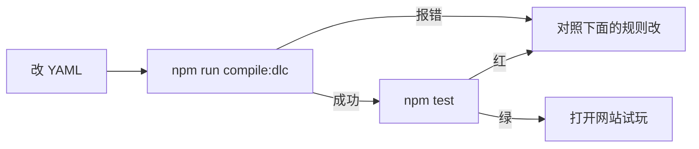
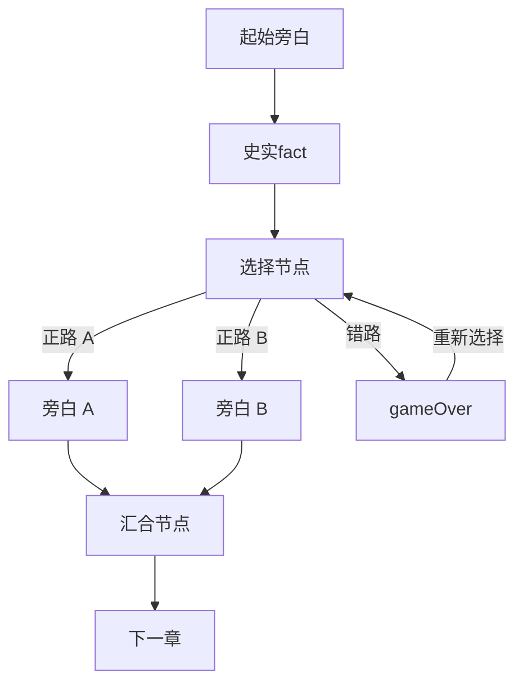

# DLC 数据结构和要求

YAML 字段、图规则和最小示例看下面。**先想清楚这一课教什么、故事怎么带、题目考什么**；带练中间产物放仓库根目录 `assets/<poetId>/<work-slug>/`（已 gitignore，见 `AGENTS.md`）。试评分/总评提示词的方法，见 [提示词试评台](teaching/prompt-lab/README.md)。作答轨迹案例见 [docs/teaching](teaching/README.md)。

## 这篇文档讲什么 / 适合谁看

- **小朋友**：想自己做一关「诗词小游戏」插件（DLC = Downloadable Learning Content，可下载的学习内容）。
- **进阶**：需要对照字段表、图校验规则和最小示例来写 YAML。

把 DLC 想成一份**手写菜谱**：你用人类好读的 YAML 写故事和题目；编译器再把它整理成厨房（游戏）看得懂的操作卡（JSON）。

---

## 小朋友版：一个 DLC 盒子里有什么

```text
dlc/sushi/                          ← 第一层：诗人 id（与诗人名单一致）
└── shuidiao-getou/                 ← 第二层：作品 slug（拼音或英文，小写短横线）
    └── hailao-shuidiao/            ← 第三层：short id，包的唯一标识（作者缩写-作品名）
        ├── manifest.yaml           ← 封面：诗人是谁、作者是谁、从哪一页开始
        ├── content/
        │   ├── story.yaml          ← 背景故事（像连环画）
        │   ├── poem.yaml           ← 诗词一句一句
        │   └── quiz.yaml           ← 课堂上的题目
        └── assets/
            ├── portraits/          ← 立绘图片（角色立绘放这里，诗人头像是公共资源不放 DLC）
            └── backgrounds/        ← 可选的章节背景图
```

> **关于目录层级**：同一个作品（如"水调歌头"）下可以有多个不同作者/不同版本的 DLC 包，每个包有独立的 short id。short id 必须全局唯一。

> **诗人头像**是公共资源，放在项目的 `public/poets/` 目录下，每个诗人一张 webp 图片，文件名与诗人 id 一致。诗人头像**不属于**任何 DLC 包。

写完后在项目根目录运行：

```bash
npm run compile:dlc
npm test
npm run dev
```

编译通过，测试变绿，才能打开网站试玩。



---

## 进阶版：四个文件的字段

`schemaVersion` 目前必须是 `1`。`id` 即 short id，只能用字母、数字、下划线和短横线，必须全局唯一。

### 1. `manifest.yaml`（封面）

| 字段 | 必填 | 含义 |
| --- | --- | --- |
| `id` / `version` / `title` | 是 | 包的 short id（全局唯一）、版本号、显示名。改故事或题目时请升 `version`，本机对局靠它判断能不能对照当前包 |
| `author` | 是 | DLC 作者名，会显示在总结页"由xxx制作" |
| `poet` / `poetId` | 是 | 诗人中文名、诗人 id（用于目录分组，必须与第一层目录名一致） |
| `workTitle` / `summary` | 是 | 词牌或篇名、一句话简介 |
| `startStoryNodeId` | 是 | 故事从哪个节点开始，不能是 `gameOver` |
| `classroom.teacher/classmate/student` | 是 | 问答舞台三个角色，必须能在 `characters` 里找到 |
| `files.story/poem/quiz` | 是 | 三个内容文件的相对路径 |
| `characters[]` | 是 | `id`、`name`、可选 `portrait` |
| `assets.music` | 否 | 背景音乐相对路径 |
| `easterEgg` | 否 | 故事结束到读词之间的可选彩蛋小游戏。**不写则最后一页只有「开始读词」，不会出现「这是什么？」** |
| `endings[]` | 否 | 真结局元数据：`endingId` / `title`，以及可选的 `subtitle` / `triggerHint` / `quote`。与故事里带 `endingId` 的 `gameOver` 对应 |

资源路径必须是相对路径，不能包含 `..`，也不能以 `/` 开头。

故事最后一页（旁白/史实省略 `nextNodeId`）默认只有「开始读词」。只有配置了 `easterEgg`，才会多出「这是什么？」：

```yaml
easterEgg:
  kind: placeholder   # 必须是引擎已登记的种类
  title: 把酒问月     # 可选
```

- 点「开始读词」：跳过小游戏，直接读词。
- 点「这是什么？」：进入小游戏，玩完再进读词。
- `kind` 必须在引擎注册表里。目前内建 `placeholder` 占位，以及 `fill-in` 填词小游戏。
- 彩蛋结果不进课堂评分。

`fill-in` 用 `params.blanks` 配空：

```yaml
easterEgg:
  kind: fill-in
  title: 补全苏轼心中那阕词
  params:
    blanks:
      - prefix: "明月几时有，把酒问"
        suffix: "。"
        correct: 青天
        options: [青天, 苍天, 长天, 远天]
```

### 2. `story.yaml`（故事图）

`chapters` 是可选的章节画面配置。每章最多配置一张背景图；同章所有节点共享它。暂时没有图时只写章节号或完全省略，框架会使用纯色背景，不会显示破图。

```yaml
chapters:
  - chapter: 1
    background: assets/backgrounds/chapter-1.webp
  - chapter: 2              # 没有 background，使用纯色
```

背景路径同样必须是安全的相对路径，编译器也会检查文件是否真实存在。

节点有五种 `type`：

**旁白 `narration`**（代入故事）

```yaml
- id: ch1_open
  type: narration
  chapter: 1
  chapterTitle: 苏轼与苏辙
  text: 你忽然发现自己变成了苏轼。
  nextNodeId: ch1_choice   # 省略表示故事结束，进入读词
  # speaker: 旁白          # 可选
  # portrait: sushi        # 可选，对应 characters.id
```

**史实 `fact`**（只讲背景知识，没有选项。点「翻到下一页」继续）

```yaml
- id: ch2_fact_reform
  type: fact
  chapter: 2
  chapterTitle: 变法与外放
  heading: 王安石变法是什么   # 可选小标题
  text: 那时宋朝正在推行「王安石变法」。……
  nextNodeId: ch2_fact_disagree
```

史实页和旁白一样走直线：没有分岔。失败用的 `gameOver`（没有 `endingId`）不能由旁白/史实直接跳入；带 `endingId` 的真结局可以。

**搜集线索 `explore`**（插在故事中间的场景点物）

```yaml
- id: s08_explore
  type: explore
  chapter: 2
  chapterTitle: 中秋夜·四下走走
  text: 月光如水，每一样物件都藏着一段回忆。
  nextNodeId: s09_after          # 必填，点齐有效线索后进入
  objects:
    - id: moon
      name: 明月
      hint: 挂在天上
      memory: 你想起小时候和子由一起赏月。
      valid: true                # 有效线索，解密后盖「有效」红戳，可重看
    - id: robe
      name: 旧官袍
      hint: 搭在椅背上
      memory: 这件官袍已经旧了。
      valid: false               # 错误线索，解密后置灰，不能再点
  hiddenReward: 你忽然明白……    # 可选；找齐全部有效线索后显示
```

- `valid` 默认 `true`。至少要有一条有效线索。
- 过关条件：找齐**全部有效线索**即可继续。错误线索可点可不点。
- 解密后：弹出解说（盖住画面，点「知道了」才关闭）。有效线索同时盖红戳「有效」，仍可点开重看；错误线索置灰且不能再点。
- `hiddenReward` 在找齐全部有效线索、关掉当前解说后，再弹一次隐藏回忆。
- 起始节点不能是 `explore`。`nextNodeId` 不能指向没有 `endingId` 的失败 `gameOver`。

**选择 `choice`**

```yaml
- id: ch2_choice
  type: choice
  chapter: 2
  chapterTitle: 变法与外放
  text: 面对变法争论，你会怎么走？
  convergesTo: ch2_join    # 正路必须汇合到这里；多结局分叉可以省略
  choices:
    - id: ask_transfer
      label: 坚持自己的看法，请求离开京城
      nextNodeId: ch2_a
    - id: stay_and_fight
      label: 留在京城，当面硬碰王安石
      nextNodeId: ch2_over   # 可以指向 gameOver
```

**结局 `gameOver`**

```yaml
- id: ch2_over
  type: gameOver
  chapter: 2
  chapterTitle: 变法与外放
  text: 这条路走不通。请回到刚才的选择。
  # endingId: ending_changjiu   # 有则是真结局，进入读词/彩蛋，而不是重选
```

没有 `endingId` 的 `gameOver` 是失败死路：玩家只能点「重新选择」，回到**刚才那个选择节点**。带 `endingId` 的是真结局，对应 `manifest.endings`，玩家继续进入彩蛋或读词。

### 剧情图规则（编译器会检查）



- 所有节点必须能从起点走到。
- 不能出现循环（不能绕圈回已经过的主线）。
- 选择节点若写了 `convergesTo`，正路必须能走到汇合点。
- 选择节点若省略 `convergesTo`，每条分支必须到达带 `endingId` 的真结局。
- 指向 `gameOver` 的选项**免做汇合检查**。
- 没有 `endingId` 的失败 `gameOver` 只能由选项进入；旁白、史实、探索不能直接指向它。带 `endingId` 的真结局可以由旁白/史实进入。
- 起始节点不能是 `gameOver` 或 `explore`。
- `explore` 的出边参与可达性与无环检查。

### 3. `poem.yaml`（读词）

```yaml
schemaVersion: 1
title: 水调歌头
lines:
  - id: line_01
    original: 明月几时有？把酒问青天。
    translation: 天上的月亮什么时候出现的呢？……
    note: 可选的小注释
    audio: assets/line_01.mp3   # 可选
```

至少一行。游戏会按数组顺序逐句揭示。

### 4. `quiz.yaml`（问答，可混合两种题）

顶层必填：

| 字段 | 含义 |
| --- | --- |
| `gradingPrompt` | 给老师的「本课怎么打分」。会追加在服务器 master prompt 后面，不能改写老师身份 |
| `summaryPrompt` | 给老师的「本课总评怎么写」 |
| `questions` | 至少 1 题，选择题和填空题可以混排 |

**选择题 `type: choice`**（浏览器对照 `correctOptionId` 打分，答后由 `feedbackSpeaker` 朗读该选项的 `feedback`。）

每题可自由组合两个开关，一共四种：

| | 无 `hint` | 有 `hint`（答题前何解说） |
| --- | --- | --- |
| `feedbackSpeaker: teacher` | 老师问 → 老师讲 | 老师问 → 何解 HINT → 老师讲 |
| `feedbackSpeaker: classmate` | 老师问 → 何解讲 | 老师问 → 何解 HINT → 何解讲 |

**第一次进入**才走上面这条开场。选择题答错后点「再答一次」，直接回到作答页（选项还在），**不要**重播老师提问，也**不要**再听一遍何解 HINT。没有 `hint` 的题，老师提问页本身就是作答页，答错后仍停在那里。

```yaml
- id: q_separate
  type: choice
  prompt: 苏轼和苏辙为什么会分开？
  feedbackSpeaker: teacher          # 答后谁讲：teacher | classmate
  # hint:                           # 可选。有则答题前播何解 HINT
  #   text: 何解抢答的话
  #   isCorrect: false              # true=帮助型，false=混淆型
  options:
    - id: reform_exile
      label: 因为变法争论，兄弟被派到不同地方
      feedback: 选这项之后，老师或何解要说的话（对错各写一句）
    - id: brothers_quarrel
      label: 兄弟吵架了
      feedback: 针对这个干扰项的讲解
  correctOptionId: reform_exile
```

**填空题 `type: open`**（提交后由服务器上的老师接口评分）

```yaml
- id: q_brother
  type: open
  prompt: 词里主要在思念谁？为什么？
  classmateAnswer: 何解先说的 HINT
  classmateIsCorrect: true
  referenceAnswer: 标准答案
  misconceptions:
    - 常见误会
  scoringPoints:
    - 提到苏辙或弟弟
    - 提到分别或七年
```

`correctOptionId` 必须是某个 `options.id`。题目 `id` 不能重复。选择题每个选项都要写 `feedback`。`hint` 可省略；省略时老师问完直接作答。

---

## 最小故事示例（能通过图检查）

```yaml
schemaVersion: 1
nodes:
  - id: start
    type: narration
    chapter: 1
    chapterTitle: 测试
    text: 故事开始。
    nextNodeId: fork
  - id: fork
    type: choice
    chapter: 1
    chapterTitle: 测试
    text: 你走哪条路？
    convergesTo: join
    choices:
      - id: safe
        label: 走正路
        nextNodeId: join
      - id: trap
        label: 走错路
        nextNodeId: over
  - id: over
    type: gameOver
    chapter: 1
    chapterTitle: 测试
    text: 此路不通。
  - id: join
    type: narration
    chapter: 1
    chapterTitle: 测试
    text: 两路汇合，准备读词。
```

完整可运行的范例见 [`dlc/sushi/shuidiao-getou/hailao-shuidiao/`](../dlc/sushi/shuidiao-getou/hailao-shuidiao/)。字段的程序定义见 [`src/dlc/schema.ts`](../src/dlc/schema.ts)，图检查见 [`src/dlc/graphValidator.ts`](../src/dlc/graphValidator.ts)。
