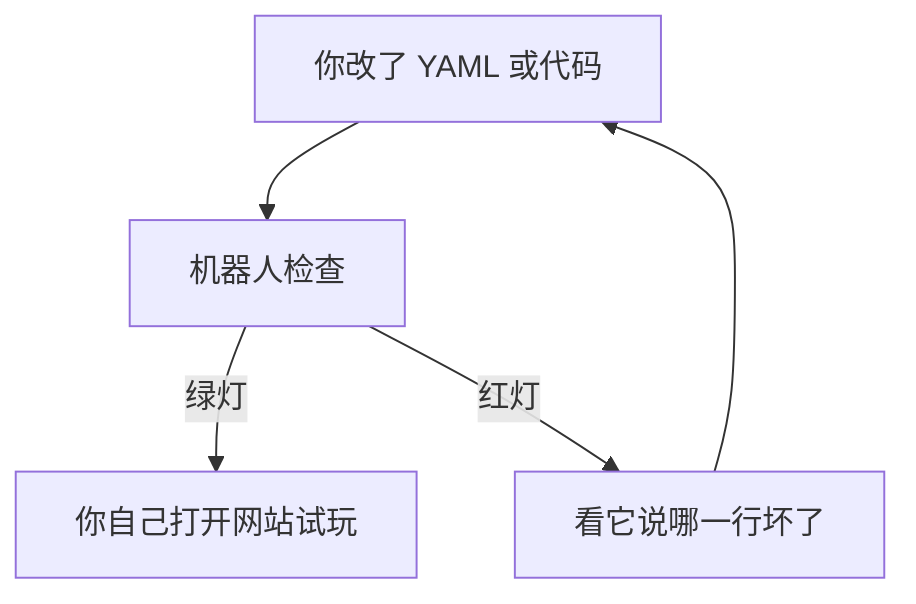

# 自动测试说明

## 这篇文档讲什么 / 适合谁看

- **小朋友**：想知道改完一关之后，为什么还要先跑一遍检查。
- **进阶**：想知道每个 Jest 文件在看什么，红灯时该怎么读。

---

## 小朋友版：机器人帮你先检查盒子

想象你刚写好一套新关卡。打开网站玩之前，先请一个**不会觉得无聊的机器人**检查：

- 某个选项是不是指到了不存在的一页
- 题目有没有写标准答案
- 走错路以后能不能回到刚才的选择

它检查的是「数据能不能加载、规则会不会卡住」。画面漂不漂亮、按钮好不好点，还要你自己打开网站看一眼。



---

## 怎么跑

在项目根目录：

```bash
npm test
```

成功时长这样（数字会变，重点看 `passed`）：

```text
Test Suites: 5 passed, 5 total
Tests:       20 passed, 20 total
```

失败时会变成红色，并写出：

1. **哪个文件**，例如 `tests/dlc-schema.test.ts`
2. **哪条用例**，例如 `allows a choice branch to end in gameOver`
3. **期望是什么、实际是什么**

读法：先看用例名字 → 对照你刚改的 YAML → 改完再跑一次。不要一次改十处再测，否则不知道是哪一处弄坏的。

给 DLC 作者的固定流程：


---

## 进阶版：现在有哪些自动测试

全部是 **Jest**，跑在 Node 里，不打开浏览器。

| 文件 | 它在看什么 |
| --- | --- |
| [`tests/dlc-schema.test.ts`](../tests/dlc-schema.test.ts) | 内置「水调歌头」能编译；剧情图规则（选择题要汇合，旁白/史实不能直接进 Game Over） |
| [`tests/compiler.test.ts`](../tests/compiler.test.ts) | 编译器写出 `catalog.json`；坏包会失败 |
| [`tests/gameMachine.test.ts`](../tests/gameMachine.test.ts) | 状态机整局：正路走完、选择题本地提交、填空模拟老师成功、Game Over 回到选择点、总评能写上 |
| [`tests/catalog.test.ts`](../tests/catalog.test.ts) | 诗人书架分组、章节中文名 |
| [`tests/eventSchema.test.ts`](../tests/eventSchema.test.ts) | 学习行为 JSON 能被解析 |

状态机测试会：

1. 走故事正路（自动避开 Game Over 选项）
2. 把诗句全部点完
3. 选择题本地提交，填空题模拟老师成功
4. 进入 `summary.generating`，再写入总评
5. 另测一条：选错路 → Game Over → `REPLAY_CHOICE` → 回到刚才的选择节点

画面、动画、预览窗口里能不能点，要在浏览器里自己过一遍。扣子预览窗口的技术说明见 [coze-dev.md](coze-dev.md)。

### 打开网站时请自己点

1. 首页能看到诗人头像，点进去能看到书架。
2. 故事正文一次显示完整段落。
3. 第二章选「留在京城硬碰王安石」会进入「此路不通」，「重新选择」回到刚才的选项。
4. 读词阶段点「下一句」或按空格，宣纸会往下走。
5. 第一题是选择题，点选项后老师立刻讲解。
6. 后两题是填空，提交后能看到老师点评（本机可配 Mock 老师）。
7. 总结页只显示课程叙事总评和制作者署名。
